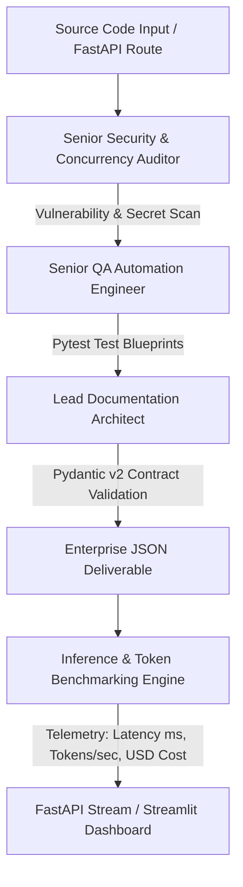

# 🤖 Enterprise Multi-Agent Software Development Crew & Latency Profiler

[](https://fastapi.tiangolo.com/)
[](https://langchain.com/)
[](https://groq.com/)
[](https://docs.pydantic.dev/)

> An autonomous, collaborative multi-agent code auditing and QA generation pipeline powered by **LangChain**, **Groq Cloud (Llama-3-70B)**, and **FastAPI**. Features real-time inference latency, token consumption, and financial API cost benchmarking under concurrent workloads.

---

## 🗺️ Agent Swarm Architecture



---

## 🕵️ Specialized Swarm Roles

1. **Security & Concurrency Auditor:** Scans code for AST patterns, SQL injection, hardcoded secrets, and blocking I/O calls within asynchronous event loops.
2. **QA Automation Architect:** Ingests the codebase and security findings to dynamically draft executable `pytest` blueprints for boundary conditions and load testing.
3. **Lead Documentation Architect:** Compiles and normalizes findings into strict Pydantic v2 JSON models, eliminating hallucinations.
4. **Benchmarking & Telemetry Engine:** Measures end-to-end inference latency (ms), token consumption (input/output/total), throughput (tokens/sec), and estimated LLM compute cost.

---

## 📦 API Endpoints

| Method | Endpoint | Description |
| :--- | :--- | :--- |
| `GET` | `/health` | Health telemetry and model cluster verification |
| `POST` | `/api/v1/audit/analyze` | Executes multi-agent audit and returns Pydantic report with telemetry |

---

## 🛠️ Quickstart

```bash
# Clone & install
git clone https://github.com/aarthis20040708-collab/enterprise-agent-crew.git
cd enterprise-agent-crew
pip install -r requirements.txt

# Run FastAPI Microservice
python api.py

# Launch Streamlit UI
streamlit run app.py
```
