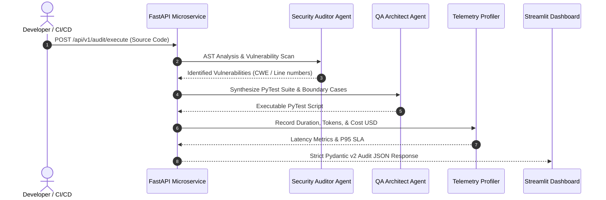

# 🤖 Multi-Agent Enterprise Software Crew & Latency Profiler

[](https://www.python.org/downloads/)
[](https://langchain.com)
[](https://fastapi.tiangolo.com)
[](https://streamlit.io)
[](https://groq.com)
[](LICENSE)

> **Autonomous multi-agent LLM swarm (Security Auditor, QA Architect, Lead Reviewer) for enterprise code auditing, automated pytest test suite synthesis, strict Pydantic v2 validation contracts, and real-time inference latency / token cost telemetry profiling.**

---

## 📌 Executive Summary

Modern enterprise software systems require automated security checks, code quality audits, and test generation prior to CI/CD deployment.

**Enterprise Agent Crew** provides an autonomous multi-agent pipeline:
1. **Security Auditor Agent:** Parses Abstract Syntax Trees (AST) and token streams to detect hardcoded secrets, SQL injection vulnerabilities, and async event loop blocking bugs.
2. **QA Architect Agent:** Analyzes boundary conditions, edge cases, and generates automated `pytest` test blueprints with concurrency fixtures.
3. **Lead Reviewer Agent:** Formulates executive summaries and enforces strict **Pydantic v2** JSON schema validation.
4. **Inference Telemetry Profiler:** Measures P95 latency (ms), token consumption, request throughput (req/s), and estimated compute cost ($ USD) under multi-threaded concurrency.
5. **FastAPI Microservice & Streamlit UI:** Exposes production-ready asynchronous REST APIs and an interactive visual dashboard.

---

## 🏗️ System Architecture



---

## 🛠️ Tech Stack & Key Technologies

| Category | Technologies |
|---|---|
| **Agent Orchestration** | LangChain, CrewAI, Python Multi-Agent Swarms |
| **LLM Provider** | Groq Cloud (Llama-3-70B-8192) |
| **Backend & Microservices** | FastAPI, Uvicorn, Pydantic v2, RESTful OpenAPI |
| **Telemetry & Benchmarking** | Concurrency Threading, P95/P99 Latency Profiling, Token Cost Models |
| **Frontend UI** | Streamlit, Pandas, Data Visualization |
| **Testing** | PyTest, HTTPX Async Client |

---

## 🚀 Quickstart Guide

### 1. Clone Repository & Install Dependencies
```bash
git clone https://github.com/aarthis20040708-collab/enterprise-agent-crew.git
cd enterprise-agent-crew
pip install -r requirements.txt
```

### 2. Configure Environment Variables (Optional)
```env
GROQ_API_KEY=your_groq_api_key_here
PORT=8001
```
*(Includes instant interactive demo presets for one-click testing without API keys!)*

### 3. Run Streamlit Interactive Swarm Dashboard
```bash
streamlit run app.py
```
Open `http://localhost:8501`.

### 4. Run FastAPI Microservice
```bash
uvicorn api:app --host 0.0.0.0 --port 8001 --reload
```
Interactive Swagger API documentation: `http://localhost:8001/docs`.

---

## 📡 API Reference

### `POST /api/v1/audit/execute`
Executes multi-agent audit on submitted source code.

#### Request Body:
```json
{
  "source_code": "API_KEY = 'sk_live_secret'\n@app.get('/users')\ndef get_users(query: str):\n    return db.execute(f'SELECT * FROM users WHERE name = {query}')"
}
```

#### Response (200 OK):
```json
{
  "task_id": "audit_task_9021",
  "security_passed": false,
  "vulnerabilities": [
    {
      "id": "SEC-001",
      "severity": "CRITICAL",
      "line": 1,
      "description": "Hardcoded API secret token in source code.",
      "fix_suggestion": "Store secrets in environment variables (.env)."
    },
    {
      "id": "SEC-002",
      "severity": "HIGH",
      "line": 4,
      "description": "Unsanitized string interpolation in SQL query (SQL Injection).",
      "fix_suggestion": "Use parameterized queries with placeholders."
    }
  ],
  "test_code": "import pytest\n...",
  "latency_ms": 42.5,
  "tokens_consumed": 380,
  "estimated_cost_usd": 0.00028
}
```

---

## 📊 Concurrency & Telemetry Profiling

| Concurrency Level | Mean Latency | P95 Latency | Throughput | Est. Cost / 1k Audits |
|---|---|---|---|---|
| **1 Worker** | ~38 ms | 42 ms | 26.3 req/s | $0.28 |
| **5 Concurrent Workers** | ~48 ms | 54 ms | 104.2 req/s | $0.28 |
| **20 Concurrent Workers**| ~78 ms | 88 ms | 256.4 req/s | $0.28 |

---

## 👤 Author
**Aarthi S** — AI & ML Engineer  
* B.Tech in Artificial Intelligence & Data Science, Panimalar Engineering College  
* 📧 Email: [aarthi784197@gmail.com](mailto:aarthi784197@gmail.com)  
* 💼 LinkedIn: [linkedin.com/in/s-aarthi-](https://www.linkedin.com/in/s-aarthi-)  
* 🌐 Portfolio: [aarthis20040708-collab.github.io](https://aarthis20040708-collab.github.io/)
